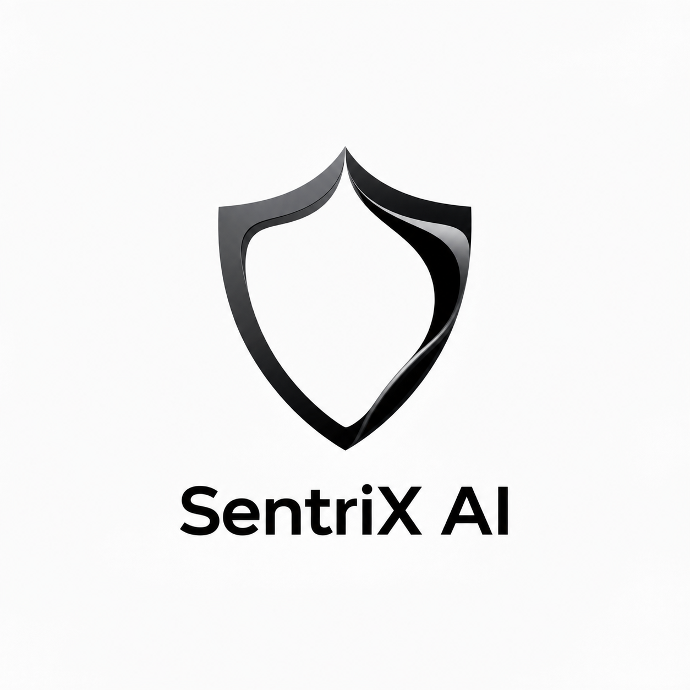

  
  

**The Autonomous AI Security Engineer for Modern Codebases**

*SentriX AI doesn't just alert you to vulnerabilities; it actively writes the code to fix them.*

---

## 🚀 The Vision

Imagine every codebase having a dedicated, hyper-vigilant Security Engineer who works at the speed of light. An engineer who:
- Maps out your entire project architecture instantly.
- Uncovers deep-rooted vulnerabilities across dependencies, secrets, and core logic.
- Speaks directly with your developers to explain security risks in plain English.
- **Autonomously generates secure, drop-in replacement code patches for critical flaws.**

---

## 🧠 The Agent Swarm Architecture

The core of SentriX AI is driven by a specialized multi-agent swarm architecture. Instead of a monolithic analysis pass, specialized AI personas tackle different attack vectors in parallel:

| Agent Persona | Focus Area | Capability |
| :--- | :--- | :--- |
| 🕵️ **Secret Agent** | Hardcoded Credentials | Deep-scans code and configuration files for exposed API keys, database credentials, and hardcoded JWT secrets. |
| 📦 **Dependency Agent** | Supply Chain Security | Cross-references manifests (`package.json`, `requirements.txt`) against known CVE databases to flag vulnerable libraries. |
| 🛡️ **Code Review Agent** | Static Analysis (SAST) | Uncovers injection flaws (SQLi, XSS, Command Injection), insecure deserialization, weak cryptography, and SSRF vulnerabilities. |

---

## ✨ Core Platform Features

### 🔍 Instant Vulnerability Mapping
Paste any public repository URL into the SentriX engine. The swarm will immediately download, parse, and analyze the codebase, surfacing a prioritized list of **CRITICAL**, **HIGH**, **MEDIUM**, and **LOW** risks with stunning visual clarity.

### 🪄 AI Patch Generation
Stop writing boilerplate security fixes. The interactive Vulnerability Explorer allows you to instantly generate secure, drop-in replacement patches using the **Gemini 3.1 Flash Lite** engine. Click a button, wait three seconds, and copy your newly secured code block.

### 💬 Interactive Security Assistant
Every scan comes paired with the SentriX Chat Agent. Don't understand why an MD5 hash is vulnerable? Open the chat interface and ask the agent to explain the attack vector and how to resolve it specifically in your project's programming language.

### 🗄️ Secure Storage Containers
Every user account receives an isolated storage container backed by MongoDB. Scan histories are securely stored and capped to ensure data freshness. Users have complete, autonomous control over their data footprint via the **Danger Zone** settings, allowing one-click data purges and complete account deletion.

---

## 🛠️ Technology Stack

<b>Click to expand architecture details</b>

 

- **Frontend Application**
  - Next.js (App Router) & React 18
  - Tailwind CSS & Framer Motion for dynamic animations
  - Monaco Editor for premium code visualization
  - Clerk Authentication for robust identity management
- **Backend Infrastructure**
  - Python 3 & Flask (Served via Gunicorn)
  - Railway Deployment
- **Database Layer**
  - MongoDB with Motor Async Driver
- **AI Integration**
  - Google Gemini Generative Language API

---

  <i>© 2026 SentriX AI. All Rights Reserved.   This is a proprietary, closed-source security platform.</i>

